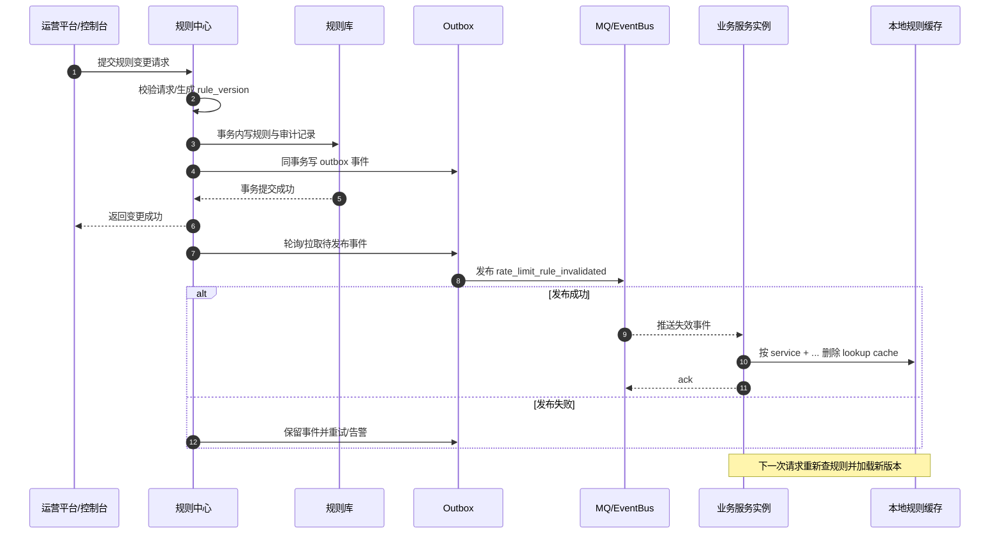
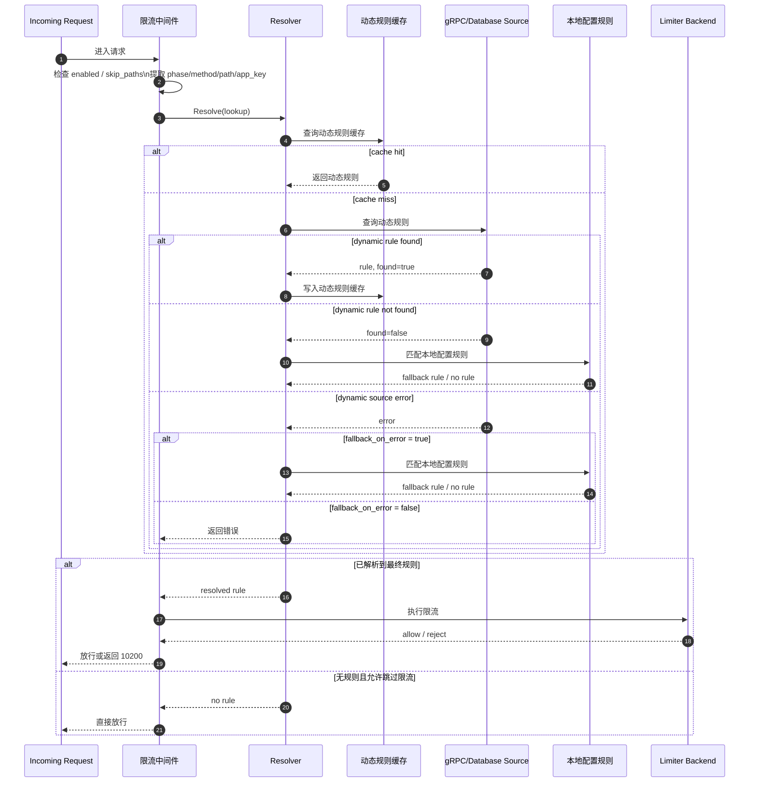
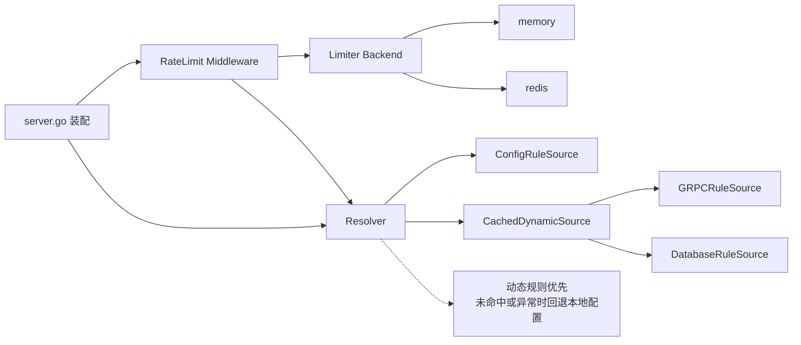

# Hertz 模板动态限流设计

读者: `ncgo` 维护者及读取或修改 `internal/assets/_data/hertz/` 模板树的
AI Agent。本文描述 Hertz 模板中动态限流能力的目标、约束、架构与落地边界。

相关总设计见
[`design-doc.zh-CN.md`](./design-doc.zh-CN.md)。

英文版专题见
[`rate-limit-dynamic-design.en.md`](./rate-limit-dynamic-design.en.md)。

## 1. 背景

当前 Hertz 模板中的限流能力主要依赖 `conf/<env>/conf.yaml` 中的静态
`rate_limit` 配置。该方案适合简单场景,但在以下需求下存在不足:

- 需要由运营平台动态下发限流规则。
- 需要按接口维度进行精细化限流。
- 需要支持 `ak + path` 这类组合维度。
- 需要在远程规则源异常时保留配置兜底能力。

因此,需要在模板中引入“动态规则源 + 本地缓存 + 配置兜底”的动态限流方案。

## 2. 目标与非目标

### 2.1 目标

- 支持从 **gRPC** 服务动态获取限流规则。
- 支持通过 **database hook + repository/sqlc 骨架** 从数据库查询限流规则。
- 支持将动态规则结果缓存到服务本地内存。
- 支持动态规则**未命中**时回退到配置文件规则。
- 支持动态规则源**异常**时按配置决定是否回退本地规则。
- 支持接口级维度,优先支持 `ak_path`。
- 支持 `fixed_window` 限流策略,同时保留 `token_bucket` 兼容能力。
- 保留现有 `memory` / `redis` 作为限流状态存储后端。

### 2.2 非目标

- 不实现规则中心主动推送。
- 不实现统一规则订阅总线。
- 不在模板中内置业务私有规则表结构,也不在默认模板里内置更复杂的 DSL、脚本或跨表规则组合能力。
- 不实现复杂多维规则优先级引擎。
- 不强制所有项目接入动态规则源,`config` 模式仍可独立使用。

### 2.3 快速摘要

如果只需要在几分钟内理解这套方案,可以先抓住下面几点:

- 整体模型是 **动态规则源 + 本地规则缓存 + 配置兜底**。
- 规则解析遵循 **动态优先**,未命中时回退本地配置;报错时由 `fallback_on_error` 决定是否回退。
- 请求真正执行限流前,还会再经过 `fail_open` 决策,用于处理最终不可恢复错误。
- 动态规则缓存的是 **规则查询结果**,不是限流计数;多实例生产环境的计数后端通常更适合 `redis`。
- 更稳妥的落地顺序是: `config` → `resolver` → 单一动态源 → cache → invalidation → rollout/rollback/outbox。
- 本文主线聚焦设计与上线建议; 代码示例和测试清单已整理到附录。

## 3. 设计总览

动态限流能力分为三层:

1. **规则来源层**: 决定规则从哪里来,支持 `config`、`grpc`、`database`。
2. **规则缓存层**: 缓存动态规则查询结果,避免每个请求都访问远程服务或数据库。
3. **限流执行层**: 根据最终解析出的规则执行限流。

其中:

- `grpc` 规则源由模板内置实现。
- `database` 规则源由模板提供默认骨架,包括 hook/interface、repository、sqlc 查询与默认表结构。
- `config` 始终作为最终兜底规则源。

### 3.1 术语表

为避免后文对同一概念出现多种说法,建议统一采用以下术语口径:

| 术语 | 含义 |
| --- | --- |
| dynamic source | 动态规则源,通常指 `grpc` 或 `database`,用于在运行时查询规则 |
| local config / config source | 本地配置规则源,来自 `conf/<env>/conf.yaml`,作为最终兜底 |
| lookup | 一次规则查询输入,通常包含 `service`、`phase`、`method`、`path` 与可选 `app_key` |
| resolved rule | resolver 最终决定交给限流器执行的规则,可能来自动态源,也可能来自本地配置 |
| default_rule | 某个 phase 下的默认兜底规则,在没有更具体匹配规则时生效 |
| fallback | 当动态规则未命中或允许回退时,继续尝试本地配置规则的过程 |
| `fallback_on_error` | resolver 层开关; 动态规则源报错后是否仍回退本地配置 |
| `fail_open` | middleware / enforcement 层开关; 最终仍报错时是否放行请求 |
| invalidation | 规则变更后触发的缓存失效动作,可通过 MQ、事件总线或 stream 传播 |
| negative cache | 对“明确未命中”结果做短 TTL 缓存,防止高并发下反复访问动态规则源 |
| rule_version | 规则版本标识,用于审计、灰度、回滚和观察当前命中的是哪一版规则 |

### 3.2 推荐阅读路径

为了让主线更聚焦,建议按下面的顺序阅读本文件:

- `1 ~ 14`: 先看核心设计、运行时流程、缓存、失效、代码组织边界
- `15 ~ 18`: 再看实施与上线建议,包括落地顺序、默认配置、风险与结论
- `附录 A / 附录 B`: 最后按需查阅接入示例与测试清单

## 4. 规则优先级与解析顺序

### 4.1 `source.type = config`

直接使用配置文件规则。

### 4.2 `source.type = grpc`

按如下顺序解析:

1. 先查本地规则缓存。
2. 缓存未命中时发起 gRPC 查询。
3. 若 gRPC **命中**规则,直接使用远程规则。
4. 若 gRPC **未命中**规则,回退配置文件规则。
5. 若 gRPC **异常**,根据 `fallback_on_error` 决定是否回退配置文件规则。

### 4.3 `source.type = database`

按如下顺序解析:

1. 先查本地规则缓存。
2. 缓存未命中时调用 database hook。
3. 若 hook **命中**规则,直接使用数据库规则。
4. 若 hook **未命中**规则,回退配置文件规则。
5. 若 hook **异常**,根据 `fallback_on_error` 决定是否回退配置文件规则。

## 5. 规则模型

### 5.1 支持的策略

- `fixed_window`: 适合运营平台常见的“固定时间窗口内最多 N 次”规则。
- `token_bucket`: 保留现有模板能力,用于兼容已有配置和流量整形场景。

### 5.2 支持的维度

建议支持以下 `key_by`:

- `ip`
- `ak`
- `user_uuid`
- `ak_user_uuid`
- `path`
- `method_path`
- `ak_path`
- `ak_method_path`

本方案优先支持 `ak_path`,用于满足“某个 app key 对某个接口限流”的核心诉求。

## 6. 配置设计

建议在 `rate_limit` 下扩展以下配置:

- `source.type`: `config` / `grpc` / `database`
- `source.cache_ttl_seconds`: 动态规则缓存 TTL
- `source.fallback_on_error`: 动态规则源异常时是否回退本地配置
- `grpc.target`: 规则中心 gRPC 地址
- `grpc.timeout_milliseconds`: gRPC 查询超时
- `grpc.auth_header` / `grpc.auth_token`: 可选鉴权参数
- `grpc.service_name`: 当前服务名
- `database.query_timeout_milliseconds`: database hook 查询超时

### 6.1 推荐配置项对照表

为了便于实现和运维对齐,建议至少把下面这些字段当作一组一起理解:

| 配置项 | 推荐值 / 常见取值 | 作用 | 风险提示 |
| --- | --- | --- | --- |
| `source.type` | `grpc` / `database` / `config` | 决定动态规则从哪里查 | 若误配为 `config`,动态规则链路会被整体绕过 |
| `source.cache_ttl_seconds` | `30 ~ 120`,默认建议 `60` | 控制动态规则结果在进程内缓存多久 | 太短会放大远程压力;太长会降低规则变更生效速度 |
| `source.fallback_on_error` | `true` | 动态规则源报错后是否继续回退本地配置 | 若设为 `false`,远程异常会更容易直接暴露到请求链路 |
| `backend` | 单体/开发期可先 `memory`,多实例生产更建议 `redis` | 决定限流计数状态存储位置 | 多副本下若仍用 `memory`,配额会在实例之间分裂 |
| `fail_open` | 默认建议 `false`; 高可用优先接口可评估 `true` | 当 resolver 或 limiter backend 仍返回不可恢复错误时,是放行还是失败 | `true` 更可用但更宽松; `false` 更安全但更可能放大依赖故障影响 |
| `skip_paths` | 如 `/healthz`, `/readyz` | 跳过无需限流的探活或内部路径 | 若配置过宽,可能把本应受限流保护的路径也绕过 |
| `grpc.timeout_milliseconds` | `100 ~ 500` | gRPC 动态查规则超时 | 过大增加长尾;过小易把正常抖动误判为失败 |
| `database.query_timeout_milliseconds` | `100 ~ 500` | database hook 查询超时 | 过大增加请求阻塞;过小可能导致数据库规则几乎不可用 |
| `grpc.service_name` | 建议固定为稳定服务名 | 作为规则命名空间与缓存 key 组成部分 | 若值漂移,会造成跨服务规则隔离失效 |
| `pre_auth.default_rule` / `post_auth.default_rule` | 建议显式配置 | 作为本地最终兜底规则 | 若未明确设计,容易出现“远程未命中后规则过松或过严” |

如果只想记住最核心的五个字段,优先关注:

- `source.type`
- `source.cache_ttl_seconds`
- `source.fallback_on_error`
- `backend`
- `fail_open`

阶段配置仍保留 `pre_auth` 和 `post_auth`,但建议扩展为:

- `enabled`
- `default_rule`
- `rules`

其中:

- `default_rule` 表示阶段默认兜底规则。
- `rules` 表示本地细粒度匹配规则集合。

`phase` 表示当前限流执行阶段,主要用于区分限流器挂载位置与规则生效时机,
而不是业务规则本身的核心身份维度。建议约定:

- `pre_auth`: 用于匿名、非法或未完成鉴权请求的兜底限流,例如缺少
  `app_key`、签名非法、鉴权头缺失等场景。此时规则查询通常依赖 `method`、
  `path` 等稳定字段,而限流执行时可使用 `client_ip` 作为 `key_by` 取值来源。
- `post_auth`: 用于已通过鉴权请求的精细限流。此时可进一步使用 `app_key`、
  `method`、`path` 等字段查询规则,并在限流执行时使用 `user_uuid` 等字段作为
  `key_by` 取值来源。

若项目仅在单一阶段执行限流,可将 `phase` 固定为对应值。

本地规则建议与动态规则源尽量保持同一套 matcher 语义。推荐字段为:

- `app_key`
- `method`
- `match_kind`
- `path` (`match_kind=exact`)
- `path_pattern` (`match_kind=prefix/glob/regex`)
- `priority`

其中 `path_prefix` 可继续作为兼容别名保留,并按 `match_kind=prefix` 解释。

本地规则建议匹配顺序如下:

1. `priority DESC`
2. `app_key` 专属规则优先于无 `app_key` 规则
3. `method` 专属规则优先于无 `method` 规则
4. `match_kind` 等级:
   - `exact`
   - `prefix`
   - `glob`
   - `regex`
5. 路径特异性更高者优先
6. `default_rule`

## 7. gRPC 规则源

模板内置 gRPC 规则源实现,职责包括:

- 根据请求上下文构造查询参数。
- 发起 gRPC 查询并设置超时。
- 将返回结果映射为统一规则结构。
- 区分“命中”“未命中”“异常”三种结果。

建议查询条件至少包含:

- `service`
- `phase`
- `method`
- `path`

在可获取时建议补充:

- `app_key`

其中,`phase` 用于区分 `pre_auth` 与 `post_auth` 的规则集合。对于匿名或非法
请求,即使缺少 `app_key`,也应能够基于 `phase`、`method`、`path` 等字段查询
兜底规则,并在实际限流时按 `key_by=ip` 使用 `client_ip`。

`user_uuid` 与 `client_ip` 更适合作为限流执行阶段中 `key_by` 的取值来源,
通常不建议作为 gRPC 规则查询条件,否则会导致规则维度过细、缓存命中率下降。
仅当业务明确需要按具体用户或具体 IP 下发差异化规则时,才建议将其作为远程
规则查询参数。

`request_id` 不建议作为规则查询条件。它更适合作为日志或链路追踪字段透传,
不应参与规则匹配,也不应进入缓存 key 设计。

gRPC 返回必须能明确表达:

- **命中规则**: 直接使用远程规则。
- **未命中规则**: 回退配置文件规则。
- **查询异常**: 根据 `fallback_on_error` 决定是否回退配置文件规则。

建议 gRPC 的接口表达层也尽量与 `config / database` 使用同一套 matcher 字段。

### 7.2 规则中心（`source.type = rule_center`）

`rule_center` 是 gRPC 规则源的一种具体实例化方式,面向多服务环境,限流规则由独立的
Kitex gRPC 服务集中管理,而不是每个服务各自实现。

#### 与 `source.type = grpc` 的区别

| 维度 | `grpc`（通用） | `rule_center`（具体） |
|---|---|---|
| Proto 契约 | 项目自定义 | ncgo 自动生成（`ratelimit.v1.RuleService`） |
| 服务端 | 项目自行实现 | ncgo 自动生成 Kitex 脚手架（`--preset rule-center`） |
| 客户端文件 | 项目手写 | ncgo 自动生成（`rule_center_client.go`） |
| 配置块 | `grpc.target` | `rule_center.address` / `rule_center.query_timeout_milliseconds` |
| CLI 入口 | 手动搭建 | `ncgo new --rule-center-addr` / `ncgo add rule-center` |

底层 `rule_center` 复用同一个 `GRPCClient` 接口,与通用 `grpc` 规则源走同一条
resolver 缓存链路。

#### 配置

```yaml
rate_limit:
  enabled: true
  source:
    type: rule_center
    cache_ttl_seconds: 60
    fallback_on_error: true
  rule_center:
    address: "rule-center:8888"
    query_timeout_milliseconds: 200
  backend: redis
```

#### 查询流程（与 gRPC 规则源一致）

1. 检查本地内存缓存（`cache_ttl_seconds` 内有效）。
2. 缓存命中 → 返回缓存规则。
3. 缓存未命中 → 向规则中心发起 gRPC `GetRule`,将结果写入缓存。
4. gRPC 失败 + `fallback_on_error: true` → 使用旧缓存规则。
5. gRPC 失败 + 无缓存 → 根据 `fail_open` 决定是否放行。

#### CLI 命令

```bash
# 创建规则中心 Kitex 服务
ncgo new rule-center --module github.com/acme/rule-center \
  --kind kitex --db postgres --preset rule-center

# 创建连接到规则中心的 Hertz 服务
ncgo new user-api --module github.com/acme/user-api \
  --kind hertz --db postgres --rule-center-addr rule-center:8888

# 为已有 Hertz 服务添加规则中心支持
ncgo add rule-center --root ./user-api --addr rule-center:8888
```

#### 生成的文件

提供 `--rule-center-addr` 时,ncgo 会生成:

- `internal/pkg/middleware/rule_center_client.go` — 实现 `ratelimit.GRPCClient`
  的 gRPC 客户端,连接到规则中心地址
- `conf/dev/conf.yaml` — `source.type` 设为 `rule_center`,并填充 `rule_center`
  配置块

`rule_center_client.go` 模板在嵌入资产树中标记为可选
（`internal/assets/_data/hertz/optional/rule_center_client.go`）,使用
`{{.GoModule}}` 占位符在生成时渲染。

### 7.3 推荐的 gRPC 请求/响应字段

`GetRuleRequest` 建议至少包含:

- `service`
- `phase`
- `method`
- `path`

其中 `service` 的职责建议明确为**规则命名空间 / 服务边界标识**。它主要用于:

- 区分“是哪个服务在查规则”
- 避免不同服务下相同 `phase + method + path` 发生规则冲突
- 让缓存、失效、审计与观测都能按服务维度隔离

它和 `app_key` 的职责不同:

- `service`: 区分**哪个服务**在查规则
- `app_key`: 区分**同一服务内哪个调用方**有专属规则

对 Hertz 单体模式,`service` 通常可以取一个稳定固定值(如服务名),不一定需要高动态性,但仍建议在协议层保留该字段。

可选补充:

- `app_key`

`GetRuleResponse` 中的规则体建议直接包含:

- `enabled`
- `key_by`
- `strategy`
- `window_seconds`
- `max_requests`
- `requests_per_second`
- `burst`
- `client_ttl_seconds`
- `match_kind`
- `path`
- `path_pattern`
- `priority`

其中:

- request 里的 `path` 表示当前请求真实路径,用于远程规则查询
- response 里的 `match_kind / path / path_pattern / priority` 表示**命中的那条规则本身**
- 即便当前 Hertz 模板 client 只消费统一后的 `RateLimitRuleConfig`,也建议 pb 层保留这些字段,方便观测、审计与调试

## 8. Database Hook

不同项目的规则表结构确实可能不同,但对于 Hertz 单体模式,模板仍建议直接提供
一套**可工作的数据库骨架**,而不是只停留在 hook 定义层。这样业务项目可以先跑通
完整链路,再逐步替换为自己的规则表与查询实现。

建议 database 规则查询字段规划与 gRPC 保持一致,至少包含:

- `phase`
- `method`
- `path`

在可获取且确实参与规则匹配时可补充:

- `app_key`

`user_uuid` 与 `client_ip` 通常不建议作为 database 规则查询条件,它们更适合作为
限流执行阶段中 `key_by` 的取值来源。

当前模板建议直接生成以下数据库骨架:

- `internal/db/schema/000002_rate_limit_rules.sql`
- `internal/db/query/rate_limit_rule.sql`
- `internal/db/migrations/000002_rate_limit_rules.sql`
- `internal/db/seed/rate_limit_rules.example.sql`
- `internal/repository/rate_limit_rule.go`
- `internal/repository/rate_limit_rule_test.go`
- `internal/base/server/server.go` 中的 database wiring

其中:

- schema / migration 提供 `rate_limit_rules` 表的默认骨架
- seed example 提供匿名兜底规则与 app 专属规则的初始化样例
- sqlc query 提供 `exact / prefix / glob / regex` 匹配与 `priority` 排序骨架
- repository 负责封装 sqlc 生成代码并映射为统一 `RateLimitRuleConfig`
- `server.go` 负责通过 `internal/base/data` 与 `samber/do` 自动装配 database source

业务项目可按需替换或扩展:

- 表结构与索引设计
- sqlc / ORM / DAO 查询逻辑
- 数据表记录到统一规则结构的映射细节

推荐将 database 模式模板化为如下调用链:

1. middleware 提取 `phase`、`method`、`path` 与可选 `app_key`。
2. resolver 先查动态规则缓存。
3. cache miss 时进入 `database_source.go`。
4. `database_source.go` 在超时控制下调用 `DatabaseHook`。
5. `DatabaseHook` 委托 `internal/repository` 中的查询函数访问数据库。
6. repository 返回业务表记录后,hook 将其映射为统一 `RateLimitRuleConfig`。
7. resolver 根据“命中 / 未命中 / 异常”决定直用、回退或报错。

为进一步降低接入成本,单体模式下建议 repository 至少暴露如下查询语义:

- `FindRule(ctx, phase, method, path, appKey)`

其中 `appKey` 允许为空,用于兼容匿名、非法或未携带 `app_key` 的请求。

database hook 同样需要区分:

- 命中规则
- 未命中规则
- 查询异常

### 8.1 默认 `rate_limit_rules` 表字段说明

默认模板生成的是**支持 `exact / prefix / glob / regex` 的规则表骨架**,适合作为 V1 起点。

| 字段 | 含义 | 默认用途 |
| --- | --- | --- |
| `phase` | 限流执行阶段 | 区分 `pre_auth` / `post_auth` |
| `method` | HTTP 方法 | 参与规则查询 |
| `match_kind` | 匹配模式 | 默认支持 `exact` / `prefix` / `glob` / `regex` |
| `path` | 精确请求路径 | `match_kind=exact` 时参与规则查询 |
| `path_pattern` | 模式路径 | `match_kind=prefix/glob/regex` 时参与规则查询 |
| `app_key` | 可选 app 维度 | 非空时表示 app 专属覆盖; 空表示 fallback |
| `priority` | 规则优先级 | 多条 pattern 规则命中时按高优先级优先 |
| `enabled` | 规则是否启用 | 控制动态规则是否生效 |
| `key_by` | 运行时限流 key 维度 | 如 `ip`、`ak_path`、`ak_user_uuid` |
| `strategy` | 限流策略 | 默认支持 `fixed_window` / `token_bucket` |
| `window_seconds` | 固定窗口时长 | `fixed_window` 常用 |
| `max_requests` | 窗口内最大请求数 | `fixed_window` 常用 |
| `requests_per_second` | 每秒补充速率 | `token_bucket` 常用 |
| `burst` | 突发容量 | `token_bucket` 常用 |
| `client_ttl_seconds` | 本地 limiter 状态 TTL 建议值 | 控制客户端状态缓存寿命 |

### 8.2 初始化样例数据

模板会同时生成:

- `internal/db/seed/rate_limit_rules.example.sql`

该文件**不会自动执行**,仅作为初始化样例。推荐包含两类起步规则:

- `pre_auth + exact + app_key=NULL` 的匿名 / 非法请求兜底规则
- `post_auth + exact + app_key=<具体值>` 的 app 定制规则
- `prefix / glob / regex + priority` 的 pattern 规则样例

这样生成工程后,业务项目可以直接复制样例数据做本地联调,而不会把示例数据硬塞进正式迁移。

### 8.3 当前模板已实现的匹配模型与继续演进边界

当前模板已经直接实现以下能力:

- `exact` 精确匹配
- `prefix` 前缀匹配
- `glob` 通配符匹配
- `regex` 正则匹配
- `priority` 优先级排序

其中 `regex` 已作为补充能力纳入默认模板,但仍建议谨慎使用,因为它会明显提高 SQL、索引与规则维护复杂度。

#### 路径匹配能力分层

当前模板中,路径匹配能力分成互斥的几类:

- `exact`: 精确路径,如 `/v1/orders`
- `prefix`: 前缀路径,如 `/v1/orders/`
- `glob`: 通配符,如 `/v1/orders/*`
- `regex`: 正则,如 `^/v1/orders/[0-9]+$`

模板当前已经落地以下字段:

- `match_kind`
- `path_pattern`
- `priority`

并避免再额外引入多个布尔开关与 `path` / `path_pattern` 交叉覆盖,否则查询语义会很难维护。

#### 规则选择顺序建议

当前 repository 的默认选择顺序就是“**先 exact, 后 pattern**”。具体为:

1. `app_key + exact`
2. `fallback + exact`
3. `app_key + pattern`
4. `fallback + pattern`

对于 pattern 规则,当前模板按以下顺序稳定排序:

1. `priority DESC`
2. `match_kind` 等级:
   - `prefix`
   - `glob`
   - `regex`
3. `specificity score DESC`
   - `prefix`: `path_pattern` 越长越优先
   - `glob`: 去掉 `*` 后剩余的字面量字符越多越优先
   - `regex`: 去掉大部分正则元字符后的“字面量风格字符”越多越优先
4. `CHAR_LENGTH(path_pattern) DESC`
5. `updated_at DESC` 或 `id DESC` 作为最终稳定 tie-breaker

#### repository / sqlc 侧建议

当前模板已经把 repository 查询拆成两段语义:

- `FindExactRule(...)`
- `FindPatternRule(...)`

虽然对外仍暴露统一的 `FindRule(...)`,但内部已按该顺序实现。不要把这些复杂规则泄漏到 middleware 或 resolver。

#### 迁移策略建议

后续若业务还要继续增强,推荐分阶段推进:

- **当前默认模板**: `exact + prefix + glob + regex + priority + matcher rank + specificity score`
- **V1.1**: 若确有需要,再补 regex flags、大小写策略或更复杂的规则组合语义
- **V2**: 若规则规模继续扩大,再考虑拆分 exact 表与 pattern 表,或引入更专门的规则中心

#### `regex` 使用建议

虽然模板已支持 `regex`,但仍建议遵循以下原则:

- 能用 `exact` 就不要用 `prefix`
- 能用 `prefix` / `glob` 就不要先上 `regex`
- `regex` 更适合路径段规则变化明显、但数量有限的场景
- 对高频热点接口,优先保留 exact / prefix 覆盖规则,避免所有请求都落到 regex 匹配

默认模板现在已经显式把 `prefix > glob > regex` 作为 matcher class rank,目的就是让更可预测、更容易维护的规则优先命中。

推荐把 `regex` 视为“补位能力”,而不是主路径。

## 9. 缓存设计

缓存的是**动态规则查询结果**,不是限流计数状态。两者职责不同,不能混用。

建议缓存 key 至少包含实际参与规则匹配的稳定字段,例如:

- `service`
- `phase`
- `method`
- `path`

并在可获取且参与匹配时补充:

- `app_key`

若一期仅优先支持 `ak + path`,可先采用 `service + phase + method + path + app_key`;
对于缺少 `app_key` 的匿名或非法请求,则采用 `service + phase + method + path`
等形式。

推荐始终显式把 `service` 放进缓存 key,即使在单体模式下它只是一个固定值。这样后续无论是拆服务、合并规则中心,还是做按服务维度的失效与审计,都不需要再改 key 语义。

### 9.1 推荐的缓存 key 结构示例

推荐使用**字段名显式可读**的 key 结构,避免只靠字段顺序拼接导致后续难以排查。例如:

- 带 `app_key` 的请求:
  - `rl:lookup:svc=order-api:phase=post_auth:m=GET:path=/v1/orders:app=demo-app`
- 不带 `app_key` 的匿名 / 非法请求:
  - `rl:lookup:svc=order-api:phase=pre_auth:m=POST:path=/v1/orders:app=_`

实现时建议注意:

- `service / phase / method` 先做统一大小写规范化
- `path` 最好先做同一套路径规范化与必要转义,避免分隔符冲突
- `app_key` 缺失时使用固定占位值(如 `_`),不要直接省略字段,否则同类 key 的结构会不稳定
- 若后续要引入版本号、环境或租户维度,建议继续用显式字段名追加,例如 `:env=prod`

建议缓存内容包括:

- 命中规则
- 空结果(negative cache)
- 可选元信息(来源、版本号)

建议默认:

- `cache_ttl_seconds = 60`
- 支持并发 miss 合并
- 支持空结果缓存

## 10. 缓存失效与规则变更传播

规则缓存不建议只依赖单一机制,推荐采用 **主动失效 + TTL 兜底** 的组合方案。

### 10.1 仅使用 TTL 的行为

若系统仅配置 TTL 缓存,则规则更新或删除后的生效方式如下:

- **更新规则**: 旧缓存会持续生效,直到 TTL 到期后,下一次请求重新查询并加载新规则。
- **删除规则**: 旧缓存同样会持续到 TTL 到期;到期后再次查询若未命中,则回退到配置文件规则。

该模式实现最简单,但缺点是规则变更不会立即生效。

### 10.2 推荐方案: 主动失效 + TTL 兜底

推荐在规则更新或删除时主动发送“缓存失效事件”,服务实例收到事件后删除对应本地缓存;
若某个实例未收到事件,TTL 仍可在到期后自动修正脏缓存。

该方案具备以下特点:

- 正常情况下,规则更新或删除后可快速生效。
- 通知链路异常时,不会造成永久脏数据。
- 兼顾实时性与系统稳健性。

### 10.2.1 推荐的失效事件 payload 示例

若采用 MQ、事件总线或 gRPC Stream 推送失效通知,建议事件体也显式包含与缓存 key
一致的命名空间字段。一个可直接参考的 **JSON payload** 如下:

```json
{
  "event_type": "rate_limit_rule_invalidated",
  "invalidate_scope": "precise",
  "service": "order-api",
  "phase": "post_auth",
  "method": "GET",
  "path": "/v1/orders",
  "app_key": "demo-app",
  "emitted_at": "2026-05-07T12:00:00Z"
}
```

字段建议如下:

- `event_type`: 事件类型,便于多类事件共用同一总线
- `invalidate_scope`: 建议支持 `precise` / `phase_prefix` / `full`
- `service`: 一级规则命名空间,应与缓存 key 中的 `service` 保持一致
- `phase / method / path / app_key`: 用于精准删除单条 lookup cache
- `emitted_at`: 便于审计与排障

对于缺少 `app_key` 的匿名 / 非法请求,建议事件里也使用与缓存 key 相同的固定占位语义,例如:

```json
{
  "event_type": "rate_limit_rule_invalidated",
  "invalidate_scope": "precise",
  "service": "order-api",
  "phase": "pre_auth",
  "method": "POST",
  "path": "/v1/orders",
  "app_key": "_"
}
```

若是按 `service + phase` 做批量失效,则可发送更短的 payload,例如:

```json
{
  "event_type": "rate_limit_rule_invalidated",
  "invalidate_scope": "phase_prefix",
  "service": "order-api",
  "phase": "post_auth"
}
```

### 10.2.2 运营侧规则变更流程建议

对于真正落地到运营平台 / 控制台的场景,推荐把“**写规则**”与“**发失效事件**”看成同一条变更链路的一部分,而不是两个互不相关的动作。

一个更稳妥的推荐流程如下:

1. 校验变更请求(字段合法性、冲突规则、灰度范围)
2. 生成新的 `rule_version` 或递增版本号
3. 在数据库事务内写入规则变更与审计记录
4. 同事务写入 outbox 事件(若采用事务外盒)
5. 事务提交成功后再异步发布失效事件
6. 由业务服务实例消费失效事件并清理本地缓存

推荐原则:

- **不要先发失效事件再写库**: 这样容易让消费方提前清缓存,但重新加载时仍读到旧规则
- **不要只写库不发事件**: 否则只能完全依赖 TTL 收敛,规则生效会变慢
- **写库成功但发事件失败** 是最需要认真处理的情况,建议靠 outbox / 重试而不是人工补发

#### 推荐的 `rule_version` 语义

建议每次规则变更都生成可审计的版本信息,例如:

- 单调递增整数版本
- 逻辑时间戳版本
- `v20260507_120000` 这类可读版本号

`rule_version` 的常见用途包括:

- 运营侧确认“当前生效的是哪一版规则”
- 服务端日志中记录命中规则版本,便于排障
- 轮询模式下作为“是否需要清理缓存”的比较依据
- 灰度发布 / 回滚时作为变更批次标识

#### 灰度发布建议

若运营平台需要更稳妥地上线规则,建议按小步灰度推进:

1. 先在低风险服务 / 低风险 phase 上启用
2. 观察命中率、429 比例、错误率、缓存 miss 量
3. 再扩大到更多接口或更多调用方

若规则中心已经支持 `service` 命名空间,灰度通常可以按以下维度之一做:

- `service`
- `phase`
- `app_key`
- 某一组明确接口路径

#### 回滚建议

建议把回滚设计成“**版本切换**”而不是临时人工改值。一个更可靠的思路是:

- 保留上一版规则快照
- 回滚时直接把目标版本重新置为当前版本
- 同样生成新的 `rule_version` 与失效事件

这样日志、审计和缓存失效链路都能保持一致,不会出现“数据库里值变了,但不知道是回滚还是新变更”的歧义。

### 10.2.3 规则变更时序图

下面这张 Mermaid 时序图把前面的推荐流程串起来,适合在设计评审或落地实现时快速对齐职责边界:



### 10.3 更新与删除场景

#### 更新规则

例如某条 `ak + path` 规则从“60 秒 100 次”调整为“60 秒 20 次”:

- **TTL 模式**: 旧规则继续生效直到缓存过期。
- **主动失效模式**: 收到失效通知后删除缓存,下一次请求立即重新加载新规则。

#### 删除规则

例如删除某个 `ak + path` 的专属规则:

- **TTL 模式**: 旧缓存保留到过期,过期后重新查询,未命中则回退配置规则。
- **主动失效模式**: 收到删除通知后删除缓存,下一次请求重新查询并直接回退配置规则。

对于“远程明确未命中”或“规则已删除”的结果,建议写入短 TTL 的空结果缓存,
以避免高并发场景下重复打远程规则源。

### 10.4 gRPC 与 database 的变更传播建议

#### gRPC 放置

推荐优先支持以下方式之一:

- **gRPC Stream 推送失效事件**: 服务实例订阅规则变更流,按事件精准删除缓存。
- **MQ / 事件总线广播**: 规则中心通过 Kafka、Redis Pub/Sub、NATS 等广播失效事件。

#### database 放置

database 本身通常不直接向业务进程推送变更事件,建议采用以下方式之一:

- **仅使用 TTL**: 简单但实时性较弱。
- **写库后同步发送失效事件**: 运营平台更新数据库后,同时广播缓存失效消息。
- **轮询版本号 / 更新时间**: 服务周期性检查规则版本变化并主动清理缓存。

### 10.5 建议支持的失效粒度

建议缓存失效事件至少支持以下粒度:

- **精准失效**: 按实际规则查询 key 删除单条缓存,例如
  `service + phase + method + path + app_key`。
- **前缀失效**: 按 `service + phase` 清理一组规则缓存。
- **全量清空**: 在紧急场景下清空整个规则缓存。

### 10.6 推荐结论

本方案建议按版本分阶段落地:

- **V1**: 先实现 TTL 缓存,规则变更在缓存过期后生效。
- **V2**: 增加主动失效通知机制,使更新/删除更快生效。
- **长期方案**: 主动失效负责加速收敛,TTL 负责最终一致性兜底。

从运营流程角度看,若规则已经变成线上控制面的一部分,建议尽量补齐:

- `rule_version`
- 审计日志
- outbox / 重试投递
- 灰度发布
- 一键回滚

这些能力不一定都要在模板首版中生成,但设计上应预留扩展空间。

## 11. 限流执行设计

限流状态存储继续沿用现有后端:

- `memory`
- `redis`

说明:

- 规则可以本地缓存。
- 但多实例部署场景下,限流计数通常应放在 Redis,否则配额会在副本之间分裂。

`fixed_window` 建议实现为:

- `memory`: 维护窗口起点与窗口内计数。
- `redis`: 使用 Lua 脚本或等价原子操作维护窗口计数与过期时间。

`token_bucket` 继续保留当前实现,用于兼容已有配置。

## 12. 中间件执行流程

每个请求进入限流中间件后,建议按如下步骤执行:

1. 判断总开关与阶段开关。
2. 判断是否命中 `skip_paths`。
3. 提取请求上下文: `app_key`、`method`、`path`、`user_uuid`、`ip`。
4. 根据 `source.type` 使用规则查询维度(如 `phase`、`method`、`path`,以及可选的
   `app_key`) 查询规则,并保留 `user_uuid`、`ip` 等字段供后续 `key_by` 取值。
5. 若动态规则命中,使用动态规则。
6. 若动态规则未命中,回退本地配置规则。
7. 若动态规则源异常,根据 `fallback_on_error` 与 `fail_open` 决策。
8. 按最终规则执行限流。
9. 返回结果: 放行或返回 `10200 rate_limited`。

### 12.1 请求侧规则解析时序图

下面这张 Mermaid 时序图把“请求进入中间件后如何解析最终规则”串成一个完整视图,便于和前面的“规则变更流程图”配套阅读:



### 12.2 请求侧异常策略矩阵

在职责边界上,建议把这两个开关分开理解:

- `fallback_on_error`: **resolver 层**开关,表示动态规则源报错后,是否继续尝试本地配置规则
- `fail_open`: **middleware / enforcement 层**开关,表示最终仍出现不可恢复错误时,是放行还是失败返回

推荐决策矩阵如下:

| 场景 | `fallback_on_error` | `fail_open` | 最终行为 | 说明 |
| --- | --- | --- | --- | --- |
| 动态规则命中 | 任意 | 任意 | 使用动态规则执行限流 | 动态规则优先级最高 |
| 动态规则未命中 | 任意 | 任意 | 回退本地匹配规则或 `phase.default_rule` | 常规 fallback 路径 |
| 动态规则源报错 | `true` | 任意 | 回退本地匹配规则或 `phase.default_rule` | 优先保证业务可用性 |
| 动态规则源报错 | `false` | `true` | 跳过本次限流并放行 | 适合更偏可用性的接口 |
| 动态规则源报错 | `false` | `false` | 返回服务不可用/依赖异常 | 适合更偏安全性的接口 |
| 已拿到最终规则,但 limiter backend 报错 | 任意 | `true` | 放行请求 | backend 侧 fail-open |
| 已拿到最终规则,但 limiter backend 报错 | 任意 | `false` | 返回服务不可用/依赖异常 | backend 侧 fail-close |
| 本地 fallback / `default_rule` 本身等价于不启用限流 | 任意 | 任意 | 不执行限流,直接放行 | 例如规则 `enabled=false` |

实务上可进一步记住一句话:

- `fallback_on_error` 决定“**动态规则失败后,还要不要继续找规则**”
- `fail_open` 决定“**最终真的报错时,请求是放行还是拦下**”

## 13. 模板改造范围

本方案主要影响以下模板生成内容:

- `conf/dev/conf.yaml`
- `internal/base/conf/conf.go`
- `internal/base/server/server.go`
- `internal/db/schema/000002_rate_limit_rules.sql`
- `internal/db/query/rate_limit_rule.sql`
- `internal/db/migrations/000002_rate_limit_rules.sql`
- `internal/db/seed/rate_limit_rules.example.sql`
- `internal/repository/rate_limit_rule.go`
- `internal/repository/rate_limit_rule_test.go`
- `internal/pkg/middleware/rate_limit.go`
- `internal/pkg/middleware/rate_limit_test.go`

建议同步更新文档:

- `design-doc.zh-CN.md`
- `design-doc.en.md`

## 14. 代码组织建议

为避免把“中间件编排”“规则解析”“gRPC 调用”“database hook”“缓存逻辑”全部堆在
`internal/pkg/middleware/rate_limit.go` 中,建议在生成项目中增加独立的限流规则解析包。

### 14.1 推荐目录

建议新增:

- `internal/pkg/ratelimit/`

用于承载动态限流规则解析域相关代码。

### 14.2 推荐职责拆分

建议按下述方式组织代码:

- `internal/pkg/ratelimit/types.go`
  - 定义 `lookup`、`resolvedRule`、`resolveResult` 等通用模型。
- `internal/pkg/ratelimit/source.go`
  - 定义统一规则源接口与通用抽象。
- `internal/pkg/ratelimit/cache.go`
  - 定义共享缓存层,例如 `CachedRuleSource`。
- `internal/pkg/ratelimit/config_source.go`
  - 本地配置规则匹配与兜底逻辑。
- `internal/pkg/ratelimit/grpc_source.go`
  - gRPC 动态规则查询实现。
- `internal/pkg/ratelimit/database_source.go`
  - database hook 包装与调用入口。
- `internal/pkg/ratelimit/resolver.go`
  - 统一解析入口,负责“动态优先 + 配置兜底”。

### 14.3 缓存层放置建议

gRPC 与 database 的缓存层不建议分别内嵌在各自实现内部,而应作为共享装饰器放在
`internal/pkg/ratelimit/cache.go` 中。

原因如下:

- 缓存的对象是“规则查询结果”,而不是某个具体 gRPC client 或 database 连接。
- gRPC 与 database 规则源都需要相同的缓存语义,适合复用同一层实现。
- 共享缓存层便于统一实现 TTL、空结果缓存与并发 miss 合并。

推荐关系如下:

- `CachedRuleSource`
  - 包装 `GRPCRuleSource`
  - 或包装 `DatabaseRuleSource`
- `Resolver`
  - 优先调用动态规则源
  - 未命中或异常时回退 `ConfigRuleSource`

#### 14.3.1 组件关系图

下面这张 Mermaid 图更适合从“静态结构”角度理解各组件之间的依赖关系:



### 14.4 中间件与 resolver 的边界

建议 `internal/pkg/middleware/rate_limit.go` 仅保留以下职责:

- 判断是否启用限流
- 判断是否命中 `skip_paths`
- 提取请求上下文
- 调用 `ratelimit.Resolver` 获取最终规则
- 调用具体限流执行逻辑
- 将拒绝结果映射为响应码

不建议在 middleware 文件中直接承载:

- gRPC 查询实现
- database hook 实现
- 规则缓存实现
- 复杂本地规则匹配逻辑

### 14.5 server 组装位置

建议在 `internal/base/server/server.go` 中完成规则解析组件的初始化与装配。

启动阶段建议流程如下:

1. 读取 `cfg.RateLimit`。
2. 根据 `source.type` 创建动态规则源。
3. 为动态规则源包裹共享缓存层。
4. 创建本地配置规则源。
5. 组装统一 `Resolver`。
6. 将 `Resolver` 传给限流中间件使用。

这样可以保证缓存与规则源是**进程级单例**,而不是在每个请求里重复创建。

### 14.6 gRPC 与 database 的放置边界

#### gRPC

建议区分两层:

- **连接或 client 构造**: 可放在 `internal/base/data` 或启动装配逻辑中。
- **规则查询语义**: 放在 `internal/pkg/ratelimit/grpc_source.go`。

#### database

建议区分两层:

- **业务查询实现**: 由业务项目放在 `internal/repository`、`internal/base/data` 或其他合适位置。
- **hook 抽象与调用**: 放在 `internal/pkg/ratelimit/database_source.go`。

### 14.7 总结

推荐的代码组织方式为:

- `internal/pkg/ratelimit/`: 规则解析、规则缓存、source 抽象、resolver
- `internal/pkg/middleware/rate_limit.go`: 中间件入口与执行编排
- `internal/base/server/server.go`: 启动时装配 resolver
- `internal/base/data`: 可选承载 gRPC client 或底层依赖构造
- 业务 repository / data 层: 实现 database hook 的具体查询逻辑

该组织方式能够降低耦合,并为后续扩展更多规则源或更多缓存失效机制预留空间。

## 15. 落地与上线建议

### 15.1 推荐的启动期策略

建议按以下策略接入:

- **V1**: 优先接 `config` + 本地 fallback 路径,确保功能先可用。
- **V1.1**: 接入真实 `grpc client` 或 `database hook`。
- **V2**: 结合前文“缓存失效与规则变更传播”机制,补主动失效链路。

若业务项目暂时还没有真实的 gRPC 或 database 规则源,可先保持 `source.type=config`,
不影响模板其余限流能力。

### 15.2 建议的落地顺序

若项目希望把这套动态限流能力按更稳妥的方式逐步上线,建议按下面的顺序推进,而不是一开始同时引入所有能力:

1. **第 0 步: 先把本地规则跑通**
   - 先用 `source.type=config`
   - 确认 `pre_auth / post_auth`、`default_rule`、`key_by`、`fixed_window` 行为正确
2. **第 1 步: 接入 resolver 统一入口**
   - 让 middleware 只依赖 `Resolver`
   - 先把“动态优先 + 本地兜底”的代码边界稳定下来
3. **第 2 步: 只接一种动态规则源**
   - 在 `grpc` 与 `database` 里先选一个
   - 先验证命中 / 未命中 / 报错三条主路径
4. **第 3 步: 再打开本地动态缓存**
   - 配 `source.cache_ttl_seconds`
   - 验证 cache hit、negative cache、TTL 过期与并发 miss 行为
5. **第 4 步: 生产环境再切换到合适 backend**
   - 单体或开发环境可先 `memory`
   - 多实例生产更建议 `redis`
6. **第 5 步: 增加主动失效链路**
   - 引入 invalidation event
   - 让规则变更不只依赖 TTL 收敛
7. **第 6 步: 补运维能力**
   - 补 `rule_version`
   - 补灰度发布 / 回滚
   - 对关键场景补 outbox / retry / audit log

推荐原因是:

- 越靠前的步骤越偏“功能可用性”
- 越靠后的步骤越偏“线上稳健性与运维能力”
- 这样可以避免在规则本身还没跑稳时,就过早把复杂度引入缓存失效、消息可靠性和回滚流程

## 16. 推荐默认配置

建议默认配置如下:

- `source.type = grpc`
- `source.cache_ttl_seconds = 60`
- `source.fallback_on_error = true`
- `strategy = fixed_window`
- `key_by = ["ak_path", "ip"]`

该默认值兼顾了动态规则能力、运行时稳定性与本地兜底能力。

## 17. 风险与注意事项

- **缓存实时性**: 启用 TTL 缓存后,规则变更不会瞬时生效。
- **多实例部署**: 生产环境建议使用 Redis 作为限流状态存储。
- **路径标准化**: 建议优先使用路由模板路径,拿不到时再退回原始路径。

## 18. 结论

本方案采用:

- gRPC 规则源内置实现
- database 规则源通过 hook 扩展
- 配置文件始终作为兜底规则源
- 动态规则结果使用本地内存缓存
- 限流执行支持 `fixed_window`,并保留 `token_bucket`
- 限流状态存储继续沿用 `memory` / `redis`

该方案兼顾了动态规则能力、模板通用性、运行时稳定性以及与现有 Hertz 模板
的兼容性。

## 19. Kitex 服务限流

本章描述 ncgo 在 **Kitex RPC** 服务侧的限流拦截实现。Hertz(HTTP)侧的设计
见本章之前的各节;Kitex 侧共享同一套限流基建(resolver / store / rule-center
client),仅在中间件适配层因框架 API 不同而各自实现。

### 19.1 背景与定位

此前 Kitex 模板生成的 `internal/base/middleware/ratelimit.go` 只是一个
pass-through 占位符(`RateLimit()` 直接 `return next(ctx, req, resp)`),拦截注释
自述"Rate-limit enforcement for Kitex services will be added in a follow-up"。
本轮把它替换为真实的限流中间件。

做 Kitex 拦截的原因:

1. **服务自保 / 防雪崩**: 下游变慢 → 上游 goroutine 堆积 → 级联崩溃。RPC 层限流是熔断前的防洪坝。
2. **Hertz 不是唯一调用方**: 服务间互调(Kitex→Kitex)、定时任务、内部工具直连 RPC,全部绕过 HTTP 入口限流。
3. **扇出放大**: 1 次 HTTP 请求可扇出为 N 次 RPC,入口限流看不见放大系数。
4. **多调用方公平性**: 按 caller 维度限流,防 noisy neighbor 吃光下游容量。
5. **边际成本极低**: rule-center、resolver、store、缓存、降级基建全部已实现,Kitex 侧只需中间件适配层。

定位:

- 与 Hertz 侧**共享** `internal/pkg/ratelimit`(resolver + store)与
  `rule_center_client`,**单一事实来源**。
- 中间件层框架各异: Hertz 适配 `app.HandlerFunc`,Kitex 适配 `endpoint.Middleware`。
- 默认生成即 **shadow 观察模式**(计数真实生效但不拒绝),运营确认后手动切 enforce。

### 19.2 双轨拦截模型

Kitex 侧采用 **双轨** 防护,两条轨道独立生效:

```
RPC 请求进入 Kitex server
  │
  ├─ 【静态轨】server.WithLimit(MaxConnections/MaxQPS)     ← 全局粗粒度兜底
  │    conf: rate_limit.static.{max_qps,max_connections}     默认 0 = 不挂载
  │    超限 → kitex 框架层直接拒绝
  │
  └─ 【动态轨】WithMiddleware 链:
       RequestID → AccessLog → Recovery
       → CallerAllowlist            ← 此处之后 caller 身份已就绪
       → middleware.RateLimit(cfg.RateLimit)   ★ 新增
       → RequestTimeout
            │
            ├─ Lookup{Service, Method, AppKey, ClientIP, Phase: "post_auth"}
            ├─ 共享 resolver: 动态源(rule_center/grpc/database)→ 缓存(TTL)
            │                 → 失败按 fallback_on_error 回退本地 config 规则
            ├─ 共享 store: memory(hot LRU)| redis(Lua 脚本)
            └─ 判决:
                 允许                    → next(ctx, req, resp)
                 超限 + mode=enforce     → BizStatusError 10429 + metainfo retry-after
                 超限 + mode=shadow      → 计数/日志/打点,放行  ← 默认模式
```

两轨职责划分:

| 轨道 | 配置入口 | 作用 | 默认状态 |
| --- | --- | --- | --- |
| 静态轨 | `rate_limit.static.{max_qps, max_connections}` | 全局连接数 / QPS 粗粒度兜底,kitex 框架层拒绝 | `0` = 不挂载 |
| 动态轨 | `rate_limit.mode` + `source.*` / `backend` | 按规则源 + caller/method 维度精细限流 | `mode = shadow`(计数不拒绝) |

### 19.3 共享基建与框架边界

为避免 hertz/kitex 两侧各自维护一份 resolver 与 store 实现,本轮把相关
asset 从 `hertz/layout.yaml` 抽出为框架无关的共享片段,放到
`internal/assets/_data/ratelimit/` 目录:

| 共享片段 | 职责 | 单一事实来源 |
| --- | --- | --- |
| `resolver.yaml` / `resolver_test.yaml` | 规则解析(动态优先 + 本地兜底 + 缓存) | 是 |
| `store.yaml` / `store_test.yaml` | 计数后端(memory / redis) | 是 |
| `rule_center_client.yaml` | rule-center gRPC 客户端 | 是 |

Hertz 的 `hertz/layout.yaml` 是 hz 工具的单文件自定义 layout,不支持外部引用。
ncgo 在 scaffold 时把形如 `# {{include: ratelimit/resolver}}` 的指令注释展开为
对应片段内容,hz 工具消费的是已缝合的完整 layout,感知不到指令存在。hertz
golden 测试保证缝合后生成输出**逐字节不变**。

**核心原则**: resolver / store / rule-center client 单一事实来源;只有中间件
适配层框架各异:

| 层 | Hertz | Kitex |
| --- | --- | --- |
| 中间件签名 | `app.HandlerFunc` | `endpoint.Middleware` |
| 请求上下文 | `*app.RequestContext` | `rpcinfo.RPCInfo` + `context.Context` |
| caller 身份 | header / meta | transmeta `x-caller-service` |
| 拒绝语义 | HTTP `429` | BizStatusError `10429` + metainfo |
| 静态兜底 | 无(hertz 无对应原语) | `server.WithLimit` |

两侧 `RateLimitConfig` 共享同一份 conf 结构,但默认值不同:**hertz `Mode` 默认
`enforce`(保持现状行为不变);kitex `Mode` 默认 `shadow`(新能力安全上线)**。
`Static` 字段仅 kitex 侧生效,hertz 侧忽略。

### 19.4 动态轨数据流

每请求在动态轨中间件内的处理步骤:

1. `!cfg.Enabled` → 直接 `next`。
2. 从 `rpcinfo.GetRPCInfo(ctx)` 取出 `ServiceName` / `RPCMethod`,从 transmeta
   取出 caller 服务名(`x-caller-service`)与 caller 地址,拼装
   `ratelimit.Lookup{Service, Method, AppKey, ClientIP, Phase: "post_auth"}`。
   `Service` 取自 `cfg.Server.Registry.Name`(服务注册名)。
3. 调 `resolver.Resolve(ctx, lookup)`:
   - 先查本地动态规则缓存(cache hit → 直接返回)。
   - cache miss → 查动态源(rule_center / grpc / database)。
   - 命中 → 写缓存并返回远程规则。
   - 未命中 / 失败 → 按 `fallback_on_error` 决定回退旧缓存或本地 config 规则;
     最终仍报错 → 按 `fail_open` 裁决。
4. `!rule.Enabled` → 直接 `next`。
5. 按 `rule.KeyBy` 维度拼接 key(维度缺失时 caller → caller-ip 降级),调
   `store.Allow(ctx, key, rule)`。**无论 shadow 还是 enforce,`Allow()` 都会真实
   计数**。
6. 判决:
   - 允许 → `next`。
   - store 错误 → `fail_open` 裁决(默认放行)。
   - 超限:
     - `mode = enforce` → `rpcerror.RateLimited(retryAfter)` 返回 BizStatusError
       `10429` + metainfo `rl-retry-after`。
     - `mode = shadow` → 计数已由 `Allow()` 完成,仅记录
       `klog.CtxWarnf(ctx, "ratelimit shadow denied: %s/%s", service, method)`
       与 `ratelimit_shadow_denied{service, method}` expvar,然后放行。

### 19.5 shadow → enforce 运维流程

默认 `mode = shadow`**只计数、不拒绝**,用于上线初期观察规则是否合理。推荐
运维流程:

1. **接入**: 在 kitex 项目执行 `ncgo add infra rate-limit`,生成共享
   `internal/pkg/ratelimit`、真实中间件 `internal/base/middleware/ratelimit.go`,
   并把 `mode = shadow` 写入 conf。
2. **配规则源**: 设置 `rate_limit.source.type`(config / database / rule_center /
   grpc),确认 resolver 能拿到预期规则。
3. **shadow 观察(建议 1-2 周)**:
   - 观察日志关键字 `ratelimit shadow denied`。
   - 观察 expvar `ratelimit_shadow_denied{service, method}` 打点,确认被标记
     拒绝的请求是否符合预期(caller、method、QPS 区间)。
   - 若 shadow 拒绝率异常高,说明规则过严或 caller 识别有误,先调规则再切
     enforce,避免误杀。
4. **切 enforce**: 确认 shadow 观察期内拒绝分布合理后,改 conf
   `rate_limit.mode = enforce`,滚动重启。
5. **复盘 enforce**: 用 e2e 验证(见 §19.8),确认超限请求按预期返回 10429。

shadow 模式的关键保障:**计数真实生效**。这意味着 shadow 期间积累的计数
行为与 enforce 完全一致——一旦切到 enforce,限流会立即按真实流量生效,不
存在"冷启动"偏差。

### 19.6 拒绝语义与 caller 处理建议

拒绝时返回 Kitex `BizStatusError`,业务错误码 **10429**(镜像 HTTP 429):

```go
// internal/pkg/rpcerror/rpcerror.go (生成产物示意)
const MetaRetryAfter = "rl-retry-after"

func RateLimited(retryAfter time.Duration) error {
    seconds := int64(defaultRetryAfterSeconds)
    if retryAfter > 0 {
        seconds = int64(retryAfter.Seconds())
    }
    extra := map[string]string{MetaRetryAfter: strconv.FormatInt(seconds, 10)}
    return kerrors.NewBizStatusErrorWithExtra(CodeRateLimited, "rate limited", extra)
}
```

- 框架将 `BizStatusError` 计为**业务错误**而非调用失败 → **不会**触发 caller
  侧基于失败率的熔断(服务治理层面的错误比率熔断统计口径不含业务错误)。
- 退避秒数通过 `BizExtra` 携带,键为 `rl-retry-after`,供 caller 做退避重试。

**caller 处理建议**:

| 场景 | 建议 |
| --- | --- |
| 通用 kitex caller | 通过 `bizErr.BizExtra()["rl-retry-after"]` 读取退避秒数,做指数退避重试 |
| 不重试的幂等场景 | 直接按 10429 限流处理(返回上游 / 降级 / 排队) |
| 监控告警 | 10429 比例突增 = 下游开始限流,应触发业务告警而非服务可用性告警 |
| 错误比率熔断 | 10429 为业务错误,不计入 caller 失败率 → 不会误触发熔断 |

### 19.7 静态兜底配置建议

静态轨(`server.WithLimit`)作为全局粗粒度安全网,独立于动态规则:

```yaml
# conf/dev/conf.yaml
rate_limit:
  static:
    max_qps: 0          # 0 = 不挂载 WithLimit
    max_connections: 0
```

`StaticLimitOption(cfg.Static) kitexserver.Option` 在 `max_qps` 与
`max_connections` 均大于 0 时返回 `kitexserver.WithLimit(&limit.Option{...})`,
否则返回 nil。astwire 在 server.go 的 `// ncgo:wire:ratelimit:static-limit`
标记后注入条件挂载语句。

配置建议:

- **默认 0 = 不挂载**,与"默认生成不误伤"原则一致。
- **压测后设值**: 在准生产压测中确认服务极限 QPS 与最大承载连接数后,设为
  略低于极限值的阈值(如极限 QPS 的 80%)。静态轨是兜底,不是精细限流工具。
- **与动态轨独立**: 静态轨超限由 kitex 框架层直接拒绝(连接关闭 / QPS 错误),
  不经过动态中间件,不产生 shadow 日志。
- 仅 kitex 侧生效;hertz 无对应原语。

### 19.8 e2e kitex 用法

`ncgo test rate-limit e2e` 通过 `--rpc-method` / `--rpc-payload` 支持 kitex
RPC 压测,使用 grpcurl 做泛化调用:

```bash
# 基本用法:对 kitex 服务压测,验证限流
ncgo test rate-limit e2e --rpc-method MyService.Ping --rpc-payload '{"user":"alice"}'

# 完整参数
ncgo test rate-limit e2e \
  --host localhost --port 8080 \
  --rpc-method MyService.Ping \
  --rpc-payload '{"user":"alice"}' \
  --rate 200 --duration 10s \
  --report report.md
```

参数说明:

| 参数 | 默认值 | 说明 |
| --- | --- | --- |
| `--rpc-method` | `<serviceName>.HealthCheck` | kitex RPC 方法,grpcurl 泛化调用格式 `Service.Method` |
| `--rpc-payload` | `{}` | RPC JSON 请求体 |
| `--rate` | 200 | 每秒请求数 |
| `--duration` | 10s | 压测时长 |

两段式验证:

1. **shadow 段**(conf `mode = shadow`): 断言**0 拒绝** + 日志含
   `ratelimit shadow denied` 记录 → 证明计数生效且未误杀。
2. **enforce 段**(conf `mode = enforce`): 断言 10429 比例 → 结果分类
   PASS / FAIL / WARN。

`--rpc-method` 默认指向 `<serviceName>.HealthCheck`,业务项目应实现一个
轻量 HealthCheck RPC 作为 e2e 靶点,避免压测污染业务接口。

### 19.9 命令说明

#### `ncgo add infra rate-limit`(kitex-only)

在 kitex 项目中启用真实限流:

```bash
ncgo add infra rate-limit [--root .] [--dry-run] [--plan] [--output json]
```

执行结果:

- 写 `internal/pkg/ratelimit/resolver.go`(共享)
- 写 `internal/pkg/ratelimit/store.go`(共享)
- 覆盖 `internal/base/middleware/ratelimit.go`(占位符 → 真实中间件)
- 更新 `conf/dev/conf.yaml`: 写入 `mode: shadow` / `backend` / `source` /
  `fail_open` / `static` 默认块
- astwire 接 `internal/base/server/server.go`: 注入
  `middleware.RateLimit(cfg.RateLimit)` 到 `CallerAllowlist` 之后,注入
  `middleware.StaticLimitOption(cfg.Static)` 到 `// ncgo:wire:ratelimit:static-limit`
  标记处

next steps 提示:

- 配置规则源(conf `rate_limit.source.type`)
- 观察 shadow 日志 1-2 周,确认后改 `mode: enforce`
- (可选)压测后设置 `static.max_qps` / `static.max_connections`

规则源客户端由中间件内部按 conf 懒初始化(`sync.Once`,建连失败不 panic,落入
resolver 的 fallback 语义),因此 `add infra rate-limit` 对 server.go 的注入
保持最小(仅两条调用语句)。提供 `RateLimitWithOptions(cfg, opts)` 供测试注入
fake。

#### `ncgo add rule-center`(kitex)

rule-center 客户端是纯 grpc + conf 代码,框架无关。kitex 分支:

- 写 `internal/pkg/rulecenter/rule_center_client.go`(与 hertz 同路径)
- 改 conf `source.type = rule_center` + `rule_center.address`
- **无需 wire server.go**: kitex 中间件按 §19.4 自建 client,不依赖注入

```bash
ncgo add rule-center --root ./user-api --addr rule-center:8888
```

### 19.10 错误处理矩阵

| 故障场景 | 行为 |
| --- | --- |
| 规则源(rule-center / db)查询失败 | `fallback_on_error: true` → 旧缓存 / 本地规则;`false` → `fail_open` 裁决 |
| store(redis)不可用 | `fail_open: true`(默认)→ 放行;`false` → 拒绝 |
| rule-center client 建连失败 | 不 panic;动态源视为失败,走上一行语义 |
| Lookup 维度缺失 | KeyBy 降级(caller → ip) |
| 静态轨超限 | kitex 框架层拒绝(连接关闭 / QPS 错误),与动态轨独立 |
| shadow 模式任何拒绝判决 | 永不中断:warn 日志 `ratelimit shadow denied` + `ratelimit_shadow_denied{service, method}` |

### 19.11 迁移与兼容性

- **Hertz 零感知**: 抽取是零行为变化的搬移 + include 缝合;hertz golden 逐字节
  保护。hertz 额外获得 `Mode` 字段但默认 `enforce`,行为不变。
- **存量 kitex 项目**: 占位符 `internal/base/middleware/ratelimit.go` 经
  `add infra rate-limit` 覆盖(`update_behavior: cover`);不执行命令则无任何变化。
- **rule-center preset 存量项目**: 重新生成或执行 add 命令后获得真实中间件;
  conf 默认 shadow,不会因升级而开始拒绝流量。

## 附录 A. 接入示例

以下示例用于说明生成项目后如何把真实的 gRPC 规则客户端或 database hook 接到
`ratelimit.Resolver` 上。示例偏骨架性质,具体字段与依赖可按业务项目调整。

### A.1 server wiring 示例

建议在 `internal/base/server/server.go` 中集中组装 resolver。对于开启数据库能力的
单体模板,当前生成代码会直接把 sqlc-backed repository 接到 `ratelimit.Options`:

```go
var rlOpts ratelimit.Options

if cfg.RateLimit.Source.Type == "grpc" {
    rlOpts.GRPC = newDynamicRuleGRPCClient(cfg)
}
if cfg.RateLimit.Source.Type == "database" {
    var dbData *data.Data
    if cfg.Database.Enabled {
        dbData = do.MustInvoke[*data.Data](injector)
    }
    rlOpts.Database = repository.NewRateLimitRuleHook(repository.NewRateLimitRuleRepository(dbData))
}

resolver := ratelimit.NewResolver(cfg.RateLimit, rlOpts)
```

建议保持以下原则:

- `resolver` 在服务启动时创建一次,作为进程级单例复用。
- 当 `source.type=config` 时,`Options` 可为空。
- 开启数据库能力的模板会默认生成可编译的 sqlc/schema/migration/repository 骨架。
- 若项目未启用数据库模板,或虽然带数据库模板但 `cfg.Database.Enabled=false`,
  `database` source 都会退回 no-op hook,最终走本地配置规则兜底。
- 对 Hertz 单体模式,建议将 database 接入收敛到 `internal/repository` + `DatabaseHook`
  这一条固定路径,避免在 middleware 或 handler 中直接查库。

### A.2 gRPC client 适配示例

模板约定的 gRPC 接口为:

```go
type GRPCClient interface {
    ResolveRateLimitRule(ctx context.Context, lookup Lookup) (*conf.RateLimitRuleConfig, bool, error)
}
```

业务项目可以写一个适配器,把真实的 pb client 映射到该接口:

```go
type dynamicRuleGRPCClient struct {
    cli pb.RuleServiceClient
}

func (c *dynamicRuleGRPCClient) ResolveRateLimitRule(ctx context.Context, lookup ratelimit.Lookup) (*conf.RateLimitRuleConfig, bool, error) {
    resp, err := c.cli.GetRule(ctx, &pb.GetRuleRequest{
        Service:  "order-api",
        Phase:    lookup.Phase,
        AppKey:   lookup.AppKey,
        Method:   lookup.Method,
        Path:     lookup.Path,
    })
    if err != nil {
        return nil, false, err
    }
    if !resp.Found {
        return nil, false, nil
    }
    return &conf.RateLimitRuleConfig{
        Enabled:       resp.Rule.Enabled,
        KeyBy:         resp.Rule.KeyBy,
        Strategy:      resp.Rule.Strategy,
        WindowSeconds: int(resp.Rule.WindowSeconds),
        MaxRequests:   int(resp.Rule.MaxRequests),
    }, true, nil
}
```

如果要把 pb 层也升级到统一 matcher 口径,建议直接提供一段**可复制的 proto/IDL 示例**,业务项目可直接放进自己的 `.proto` 文件后再按需调整包名、service 名或字段编号:

```proto
syntax = "proto3";

package ratelimit.v1;

option go_package = "your/module/path/api/ratelimit/v1;ratelimitv1";

service RuleService {
  rpc GetRule(GetRuleRequest) returns (GetRuleResponse);
}

message GetRuleRequest {
  string service = 1;
  string phase = 2;
  string method = 3;
  string path = 4;
  optional string app_key = 5;
}

message GetRuleResponse {
  bool found = 1;
  RateLimitRule rule = 2;
}

message RateLimitRule {
  bool enabled = 1;
  repeated string key_by = 2;
  string strategy = 3;
  int32 window_seconds = 4;
  int32 max_requests = 5;
  double requests_per_second = 6;
  int32 burst = 7;
  int32 client_ttl_seconds = 8;
  string match_kind = 9;
  string path = 10;
  string path_pattern = 11;
  int32 priority = 12;
}
```

其中:

- `GetRuleRequest.path` 是“本次请求路径”
- `GetRuleResponse.found` 表示是否命中远程规则
- `RateLimitRule.path/path_pattern` 是“命中规则的匹配字段”
- 若命中的是 `exact` 规则,返回 `match_kind=exact` 与 `path`
- 若命中的是 `prefix/glob/regex` 规则,返回对应的 `match_kind` 与 `path_pattern`

### A.2.1 规则中心服务端 `GetRule` handler 示例

如果业务项目还要实现**规则中心服务端**,可以先用一段骨架化 handler 把数据库 / 仓储层查询结果映射成 gRPC 响应:

```go
type RuleRecord struct {
    Enabled           bool
    KeyBy             []string
    Strategy          string
    WindowSeconds     int
    MaxRequests       int
    RequestsPerSecond float64
    Burst             int
    ClientTTLSeconds  int
    MatchKind         string
    Path              string
    PathPattern       string
    Priority          int
    RuleVersion       string
    UpdatedAt         time.Time
}

type RuleQueryService interface {
    GetRule(ctx context.Context, service, phase, method, path, appKey string) (*RuleRecord, error)
}

type Logger interface {
    Infow(msg string, keysAndValues ...any)
    Errorw(msg string, keysAndValues ...any)
}

type RuleServiceServer struct {
    pb.UnimplementedRuleServiceServer
    svc RuleQueryService
    log Logger
}

func (s *RuleServiceServer) GetRule(ctx context.Context, req *pb.GetRuleRequest) (*pb.GetRuleResponse, error) {
    service := strings.TrimSpace(req.GetService())
    phase := strings.ToLower(strings.TrimSpace(req.GetPhase()))
    method := strings.ToUpper(strings.TrimSpace(req.GetMethod()))
    path := strings.TrimSpace(req.GetPath())
    appKey := strings.TrimSpace(req.GetAppKey())

    switch {
    case service == "":
        return nil, status.Error(codes.InvalidArgument, "service is required")
    case phase == "":
        return nil, status.Error(codes.InvalidArgument, "phase is required")
    case method == "":
        return nil, status.Error(codes.InvalidArgument, "method is required")
    case path == "":
        return nil, status.Error(codes.InvalidArgument, "path is required")
    }

    rule, err := s.svc.GetRule(
        ctx,
        service,
        phase,
        method,
        path,
        appKey,
    )
    if err != nil {
        if s.log != nil {
            s.log.Errorw("rate-limit rule lookup failed",
                "service", service,
                "phase", phase,
                "method", method,
                "path", path,
                "app_key", appKey,
                "error", err,
            )
        }
        return nil, status.Error(codes.Internal, "rule lookup failed")
    }
    if rule == nil {
        if s.log != nil {
            s.log.Infow("rate-limit rule miss",
                "service", service,
                "phase", phase,
                "method", method,
                "path", path,
                "app_key", appKey,
            )
        }
        return &pb.GetRuleResponse{Found: false}, nil
    }
    if s.log != nil {
        s.log.Infow("rate-limit rule hit",
            "service", service,
            "phase", phase,
            "method", method,
            "path", path,
            "app_key", appKey,
            "match_kind", rule.MatchKind,
            "priority", rule.Priority,
            "rule_version", rule.RuleVersion,
            "updated_at", rule.UpdatedAt,
        )
    }
    return &pb.GetRuleResponse{
        Found: true,
        Rule: &pb.RateLimitRule{
            Enabled:           rule.Enabled,
            KeyBy:             append([]string(nil), rule.KeyBy...),
            Strategy:          rule.Strategy,
            WindowSeconds:     int32(rule.WindowSeconds),
            MaxRequests:       int32(rule.MaxRequests),
            RequestsPerSecond: rule.RequestsPerSecond,
            Burst:             int32(rule.Burst),
            ClientTtlSeconds:  int32(rule.ClientTTLSeconds),
            MatchKind:         rule.MatchKind,
            Path:              rule.Path,
            PathPattern:       rule.PathPattern,
            Priority:          int32(rule.Priority),
        },
    }, nil
}
```

这段示例有几个关键点:

- `service` 在服务端也必须参与规则查询,避免跨服务规则冲突
- handler 负责做轻量归一化(大小写、空白)与基础参数校验
- `Found=false` 与 `error!=nil` 必须严格区分,这样下游 resolver 才能正确决定是否 fallback
- 推荐在日志里记录 `match_kind / priority / rule_version / updated_at`,便于排查规则命中行为
- 如果后续 proto 需要更强观测能力,可再把 `rule_version / updated_at` 扩展到响应字段或 trailer / header

### A.2.2 query service / repository / DAO 示例

为了让 `GetRule` handler 足够薄,推荐把 **exact / pattern 查询顺序** 收敛在 query service 或 repository 层,而不是散落在 handler 里。一个可复制的骨架如下:

```go
type RuleRow struct {
    Enabled           bool
    KeyBy             []string
    Strategy          string
    WindowSeconds     int
    MaxRequests       int
    RequestsPerSecond float64
    Burst             int
    ClientTTLSeconds  int
    MatchKind         string
    Path              string
    PathPattern       string
    Priority          int
    RuleVersion       string
    UpdatedAt         time.Time
}

type RuleRepository interface {
    FindExactRule(ctx context.Context, service, phase, method, path, appKey string) (*RuleRow, error)
    FindPatternRule(ctx context.Context, service, phase, method, path, appKey string) (*RuleRow, error)
}

type RuleQueryServiceImpl struct {
    repo RuleRepository
}

func (s *RuleQueryServiceImpl) GetRule(ctx context.Context, service, phase, method, path, appKey string) (*RuleRecord, error) {
    if row, err := s.repo.FindExactRule(ctx, service, phase, method, path, appKey); err != nil {
        return nil, err
    } else if row != nil {
        return mapRuleRow(row), nil
    }

    if row, err := s.repo.FindPatternRule(ctx, service, phase, method, path, appKey); err != nil {
        return nil, err
    } else if row != nil {
        return mapRuleRow(row), nil
    }

    return nil, nil
}

func mapRuleRow(row *RuleRow) *RuleRecord {
    if row == nil {
        return nil
    }
    return &RuleRecord{
        Enabled:           row.Enabled,
        KeyBy:             append([]string(nil), row.KeyBy...),
        Strategy:          row.Strategy,
        WindowSeconds:     row.WindowSeconds,
        MaxRequests:       row.MaxRequests,
        RequestsPerSecond: row.RequestsPerSecond,
        Burst:             row.Burst,
        ClientTTLSeconds:  row.ClientTTLSeconds,
        MatchKind:         row.MatchKind,
        Path:              row.Path,
        PathPattern:       row.PathPattern,
        Priority:          row.Priority,
        RuleVersion:       row.RuleVersion,
        UpdatedAt:         row.UpdatedAt,
    }
}
```

若底层使用 sqlc / ORM / DAO,建议 repository 继续保持“**先 exact, 后 pattern**”的边界。也就是说:

- `FindExactRule(...)` 内部可继续处理 `app_key` 专属优先于 fallback
- `FindPatternRule(...)` 内部可继续处理 `prefix / glob / regex` 的排序与 specificity 规则
- handler 只依赖 `GetRule(...)` 的最终结果,不要重复实现匹配逻辑

#### `FindExactRule(...)` 的 DAO / SQL 骨架

在更接近生产的实现里,`FindExactRule(...)` 往往仍然建议拆成“app 专属优先, fallback 次之”的两步:

```go
func (r *SQLRuleRepository) FindExactRule(ctx context.Context, service, phase, method, path, appKey string) (*RuleRow, error) {
    if appKey != "" {
        row, err := r.q.GetExactRuleByAppKey(ctx, GetExactRuleByAppKeyParams{
            Service: service, Phase: phase, Method: method, Path: path, AppKey: appKey,
        })
        if err == nil {
            return mapExactRow(row), nil
        }
        if !errors.Is(err, pgx.ErrNoRows) {
            return nil, err
        }
    }
    row, err := r.q.GetExactRuleFallback(ctx, GetExactRuleFallbackParams{
        Service: service, Phase: phase, Method: method, Path: path,
    })
    if errors.Is(err, pgx.ErrNoRows) {
        return nil, nil
    }
    if err != nil {
        return nil, err
    }
    return mapExactFallbackRow(row), nil
}
```

可参考的 SQL 形态如下:

```sql
SELECT ...
FROM rate_limit_rules
WHERE service = $1
  AND phase = $2
  AND method = $3
  AND match_kind = 'exact'
  AND path = $4
  AND app_key = $5
ORDER BY priority DESC, updated_at DESC, id DESC
LIMIT 1;

SELECT ...
FROM rate_limit_rules
WHERE service = $1
  AND phase = $2
  AND method = $3
  AND match_kind = 'exact'
  AND path = $4
  AND app_key IS NULL
ORDER BY priority DESC, updated_at DESC, id DESC
LIMIT 1;
```

#### `FindPatternRule(...)` 的 DAO / SQL 骨架

`FindPatternRule(...)` 建议同样保持“app 专属优先, fallback 次之”,但内部排序要继续遵循前文的 matcher rank 与 specificity 规则:

```go
func (r *SQLRuleRepository) FindPatternRule(ctx context.Context, service, phase, method, path, appKey string) (*RuleRow, error) {
    if appKey != "" {
        row, err := r.q.GetPatternRuleByAppKey(ctx, GetPatternRuleByAppKeyParams{
            Service: service, Phase: phase, Method: method, Path: path, AppKey: appKey,
        })
        if err == nil {
            return mapPatternRow(row), nil
        }
        if !errors.Is(err, pgx.ErrNoRows) {
            return nil, err
        }
    }
    row, err := r.q.GetPatternRuleFallback(ctx, GetPatternRuleFallbackParams{
        Service: service, Phase: phase, Method: method, Path: path,
    })
    if errors.Is(err, pgx.ErrNoRows) {
        return nil, nil
    }
    if err != nil {
        return nil, err
    }
    return mapPatternFallbackRow(row), nil
}
```

对应的 SQL 骨架可类似:

```sql
SELECT ...
FROM rate_limit_rules
WHERE service = $1
  AND phase = $2
  AND method = $3
  AND app_key = $5
  AND (
        (match_kind = 'prefix' AND $4 LIKE path_pattern || '%')
     OR (match_kind = 'glob' AND $4 LIKE ...)
     OR (match_kind = 'regex' AND $4 ~ path_pattern)
  )
ORDER BY
  priority DESC,
  CASE match_kind WHEN 'prefix' THEN 3 WHEN 'glob' THEN 2 WHEN 'regex' THEN 1 ELSE 0 END DESC,
  CASE match_kind
    WHEN 'prefix' THEN CHAR_LENGTH(path_pattern)
    WHEN 'glob' THEN CHAR_LENGTH(REPLACE(path_pattern, '*', ''))
    WHEN 'regex' THEN CHAR_LENGTH(REGEXP_REPLACE(path_pattern, '[^A-Za-z0-9/_-]+', '', 'g'))
    ELSE 0
  END DESC,
  CHAR_LENGTH(path_pattern) DESC,
  updated_at DESC,
  id DESC
LIMIT 1;
```

若规则中心直接落 PostgreSQL,建议索引也按查询边界配套规划,例如:

- exact: `(service, phase, method, path, app_key)`
- pattern: `(service, phase, method, match_kind, path_pattern, app_key, priority)`

注意 pattern 场景下索引通常更多是为了缩小候选集合;真正的 matcher 排序与 regex 判定仍需要结合查询条件与数据量做权衡。

### A.2.3 规则更新后的失效事件发布示例

若规则中心负责写库并主动推送缓存失效事件,可以用类似下面的骨架:

```go
type InvalidationEvent struct {
    EventType       string    `json:"event_type"`
    InvalidateScope string    `json:"invalidate_scope"`
    Service         string    `json:"service"`
    Phase           string    `json:"phase,omitempty"`
    Method          string    `json:"method,omitempty"`
    Path            string    `json:"path,omitempty"`
    AppKey          string    `json:"app_key,omitempty"`
    EmittedAt       time.Time `json:"emitted_at"`
}

type InvalidationPublisher interface {
    Publish(ctx context.Context, evt InvalidationEvent) error
}

type PublisherLogger interface {
    Infow(msg string, keysAndValues ...any)
    Errorw(msg string, keysAndValues ...any)
}

func publishRuleInvalidation(ctx context.Context, pub InvalidationPublisher, log PublisherLogger, service, phase, method, path, appKey string) error {
    if strings.TrimSpace(appKey) == "" {
        appKey = "_"
    }
    evt := InvalidationEvent{
        EventType:       "rate_limit_rule_invalidated",
        InvalidateScope: "precise",
        Service:         strings.TrimSpace(service),
        Phase:           strings.ToLower(strings.TrimSpace(phase)),
        Method:          strings.ToUpper(strings.TrimSpace(method)),
        Path:            strings.TrimSpace(path),
        AppKey:          appKey,
        EmittedAt:       time.Now().UTC(),
    }
    if err := pub.Publish(ctx, evt); err != nil {
        if log != nil {
            log.Errorw("publish rate-limit invalidation failed",
                "service", evt.Service,
                "phase", evt.Phase,
                "method", evt.Method,
                "path", evt.Path,
                "app_key", evt.AppKey,
                "error", err,
            )
        }
        return err
    }
    if log != nil {
        log.Infow("published rate-limit invalidation",
            "service", evt.Service,
            "phase", evt.Phase,
            "method", evt.Method,
            "path", evt.Path,
            "app_key", evt.AppKey,
            "scope", evt.InvalidateScope,
        )
    }
    return nil
}
```

推荐保持以下约束:

- 发布事件时使用与缓存 key **完全一致**的字段规范化规则
- `app_key` 缺失时与缓存 key 一样使用固定占位值(如 `_`)
- 若是 `service + phase` 级别批量失效,则改为发送 `invalidate_scope=phase_prefix`
- 不要静默吞掉 publish 失败;至少应记录错误并回传,或进入 outbox / 重试队列
- 若运营平台对“写规则成功但失效未发出”敏感,建议采用 **事务外盒(outbox)** 或可靠消息投递,而不是只依赖内存内同步重试

推荐约定如下:

- 远程规则**命中**时返回 `rule, true, nil`
- 远程规则**未命中**时返回 `nil, false, nil`
- 远程查询**异常**时返回 `nil, false, err`

这样 `Resolver` 才能正确区分“回退配置”和“直接报错/按 fail_open 处理”。

### A.3 database hook 适配示例

模板约定的 database hook 接口为:

```go
type DatabaseHook interface {
    ResolveRateLimitRule(ctx context.Context, lookup Lookup) (*conf.RateLimitRuleConfig, bool, error)
}
```

当前模板已在 `internal/repository/rate_limit_rule.go` 生成默认实现。若业务项目要替换,
建议仍保持同样的接口与调用语义:

```go
type RateLimitRuleFinder interface {
    FindRule(ctx context.Context, phase, method, path, appKey string) (*RateLimitRuleRecord, error)
}

func (h *RateLimitRuleHook) ResolveRateLimitRule(ctx context.Context, lookup ratelimit.Lookup) (*conf.RateLimitRuleConfig, bool, error) {
    rule, err := h.finder.FindRule(ctx, lookup.Phase, lookup.Method, lookup.Path, lookup.AppKey)
    if err != nil {
        return nil, false, err
    }
    if rule == nil {
        return nil, false, nil
    }
    return mapRateLimitRuleRecord(rule), true, nil
}
```

建议将数据库表到统一规则结构的映射继续收敛在 repository / hook 边界内,而不是把
sqlc 或 repository 细节暴露给 middleware 或 resolver。

对 Hertz 单体模式,当前模板已经把以下部分骨架化:

- `RateLimitRuleRepository.FindRule(...)`
- 按 `app_key` 精确匹配与 fallback 查询
- 表字段到 `RateLimitRuleConfig` 的默认映射

业务项目通常只需要在此基础上调整真实表结构、查询条件与字段映射。

## 附录 B. 测试与验证清单

建议新增或补齐以下测试:

- 配置测试: `source.type`、gRPC/database 配置合法性、策略参数合法性。
- 规则解析测试: gRPC/database 命中、未命中、异常与 fallback 行为。
- 缓存测试: 命中缓存、空结果缓存、TTL 过期、并发 miss 合并。
- 限流测试: `ak_path` key 生成、fixed window 行为、动态规则优先于本地规则。
- repository/sqlc 测试: lookup 归一化、`app_key` 精确匹配、fallback 查询、字段映射拷贝语义。
- 规则表演进测试: `priority` 排序、pattern / wildcard / regex 匹配优先级与 exact 覆盖关系。

### B.1 推荐测试清单

若要把这套动态限流真正上线,建议至少逐项确认下面这份 checklist:

| 测试域 | 关键场景 | 预期结果 |
| --- | --- | --- |
| 配置校验 | `source.type`、`backend`、timeout、策略参数非法 | 配置在启动期即失败,不要带病运行 |
| Resolver | 动态规则命中 | 返回动态规则,且 `Source=grpc/database` |
| Resolver | 动态规则未命中 | 回退本地规则或 `default_rule` |
| Resolver | 动态规则报错 + `fallback_on_error=true` | 回退本地规则,不直接把错误抛给正常请求 |
| Resolver | 动态规则报错 + `fallback_on_error=false` | 向 middleware 返回错误,交由 `fail_open` 决策 |
| Cache | 命中缓存 / TTL 过期 / 空结果缓存 | 命中时减少远程调用,过期后重新加载,未命中可被短 TTL 缓存 |
| Cache | 并发 miss | 避免高并发下重复打爆 gRPC 或数据库 |
| Middleware | 命中 `skip_paths` | 直接放行,不进入规则解析与限流执行 |
| Middleware | `fail_open=true` 下 resolver 或 backend 报错 | 请求应放行 |
| Middleware | `fail_open=false` 下 resolver 或 backend 报错 | 请求应返回可观测的失败响应 |
| Enforcement | `ak_path` / `ip` / `ak_user_uuid` 等 `key_by` 组合 | 限流 key 正确生成,不同维度不会串扰 |
| Backend | `memory` fixed window | 单进程内计数与窗口切换正确 |
| Backend | `redis` fixed window | 多实例下共享计数正确,原子性符合预期 |
| Repository / SQL | `app_key` 精确命中优先于 fallback | 专属规则覆盖通用规则 |
| Repository / SQL | `exact / prefix / glob / regex / priority` 排序 | 最终命中的规则符合预期优先级 |
| Invalidation | 规则更新后事件字段规范化、缓存 key 对齐 | 收到事件后能精准删除对应 cache |
| Rollout / Rollback | 新旧 `rule_version` 切换 | 灰度与回滚后命中版本符合预期,日志可审计 |

若时间有限,最小可用测试集建议优先覆盖:

1. 动态规则命中 / 未命中 / 报错三条 resolver 主路径
2. `fallback_on_error` 与 `fail_open` 的组合行为
3. `app_key` 专属规则覆盖 fallback 规则
4. 缓存 TTL 与空结果缓存
5. 多实例场景下的 `redis` 限流行为
